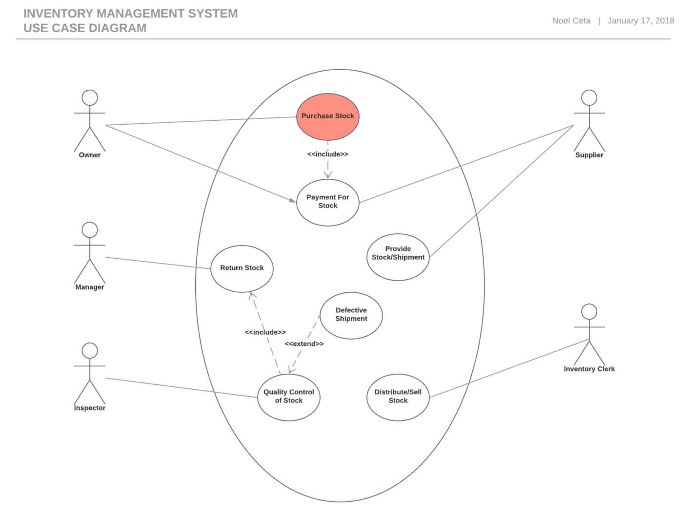
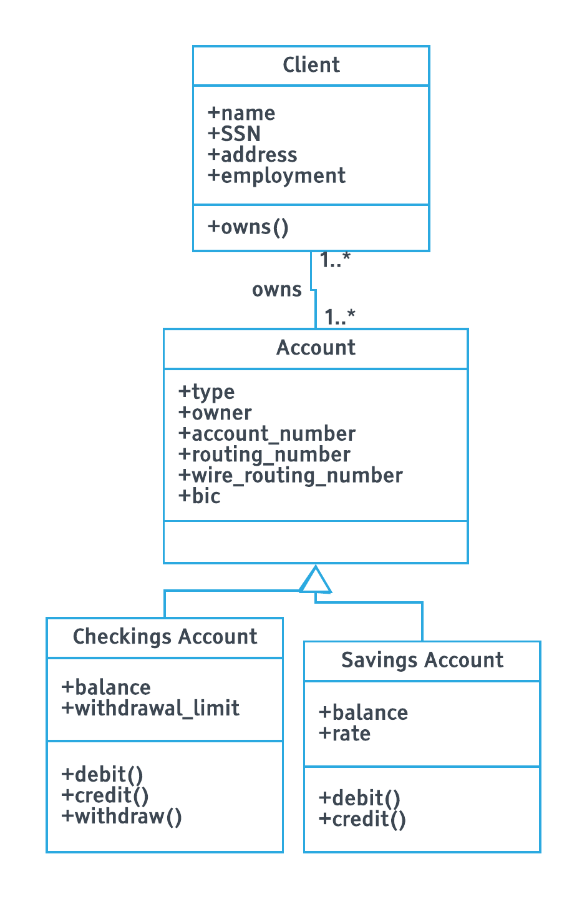
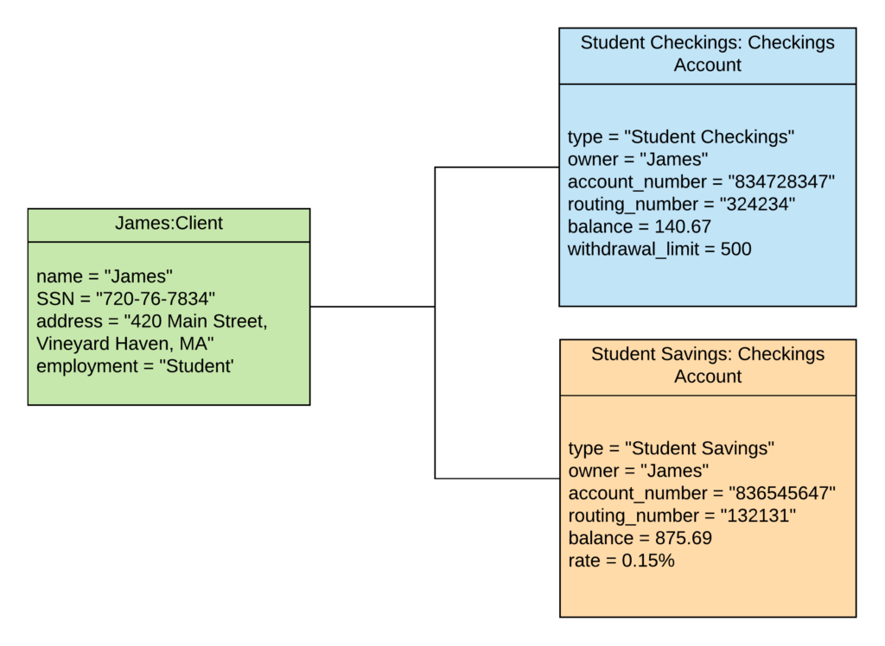
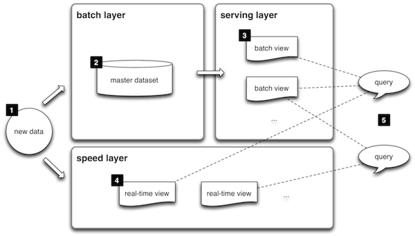

# links
  - [uml tutorial](https://tallyfy.com/uml-diagram/)

# terminology
  - uml:  Unified Modeling Language. approach to modeling and documenting software. one of the most popular business process modeling techniques.
    - It is based on diagrammatic representations of software components
  - Functional requirements: represented as use cases; a verb describing an action
  - Actors: they interact with the system; an actor can be a human being, an organization or an internal or external application
  - Relationships: between actors and use cases; usually represented using straight arrows

# basics
## Why?
  - By using visual representations, we are able to better understand possible flaws or errors in software or business processes.
  -  used to communicate different aspects and characteristics of a system

## types of diagrams
  - Behavioral UML Diagram: describe the behavior of the system, its actors, and its building components.
    - Activity Diagram
    - Use Case Diagram
    - Interaction Overview Diagram
    - Timing Diagram
    - State Machine Diagram
    - Communication Diagram
    - Sequence Diagram
  - Structural UML Diagram: analyze and depict the structure of a system or process
    - Class Diagram
    - Object Diagram
    - Component Diagram
    - Composite Structure Diagram
    - Deployment Diagram
    - Package DIagram
    - Profile Diagram

## approaches
  1. Forward Design:  The design sketch is done before coding the application. This is done to get a better view of the system or workflow that you are trying to create
  2. Backward Design: After writing the code, the UML diagrams are drawn as a form of documentation for the different activities, roles, actors, and workflows.

# Examples
## Behavior Diagrams
### Activity Diagram
  - describe the flow of different activities and actions. These can be both sequential and in parallel.
  - describe the objects used, consumed or produced by an activity and the relationship between the different activities
  - A process is not focused on what is being produced but rather on the set of activities that lead to one another and how they are interconnected, with a clear beginning and end.
  - can be used as a replacement for flow charts; provide both a more standardized way of modeling workflows as well as a wider range of features to improve readability and efficacy.
    - 
      - *the set of activities that take place in a content publishing process*

### Use Case Diagram
  - used to analyze the system’s high-level functional requirements that the system fulfillsworkflows
    - 
      - *depicts the use case UML diagram for an inventory management system. In this case, we have the owner, the supplier, the manager, the inventory clerk and the inventory inspector.*

## Structural Diagrams
### Class Diagram
  - contain classes, alongside with their attributes (also referred to as data fields) and their behaviors (also referred to as member functions)
    - each class has 3 fields: the class name at the top, the class attributes right below the name, the class operations/behaviors at the bottom. The relation between different classes (represented by a connecting line), makes up a class diagram.
  - Since most software being created nowadays is still based on the Object-Oriented Programming paradigm, using class diagrams to document the software turns out to be a common-sense solution. This happens because OOP is based on classes and the relations between them.
    - 
      - *The ‘Checkings Account’ class and the ‘Savings Account’ class both inherit from the more general class, ‘Account’. The inheritance is shown using the blank-headed arrow.*

### Object Diagram
  - help software developers check whether the generic abstract structure that they have created (class diagram), represents a viable structure when put into practice, i.e: when the objects of a class are instantiated. Some developers see it as a secondary level of accuracy checking.
    - 
      - * based on the class diagram we showed earlier. It depicts instances (objects) of the classes we created earlier*
### Component Diagram
  - break down the system into smaller components
    - 
      - *shows how a component diagram can help us get a simplified top-level view of a more complex system*